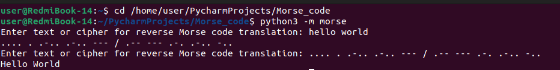

# Convert English text to Morse code and vice versa


<b>Real-time monitoring program for RAM, CPU, and hard drive usage. Written in Python with GUI support.</b>
<p>
  
  
  
  
  
  

  
  
  
</p>





## How to install and run
____
### Clone the repository
 
```sh
$ cmd
$ git clone https://github.com/BEPb/Morse_code
$ cd python-bot
```
 
### Install the necessary packages (Install dependencies)
```sh
$    -r requirements.txt
```

## Usage
In the terminal, change to the program directory:
```
$ cd Morse_code
```
and enter:
```
python3 -m morse
```
enter text or cipher for reverse morse code translation


